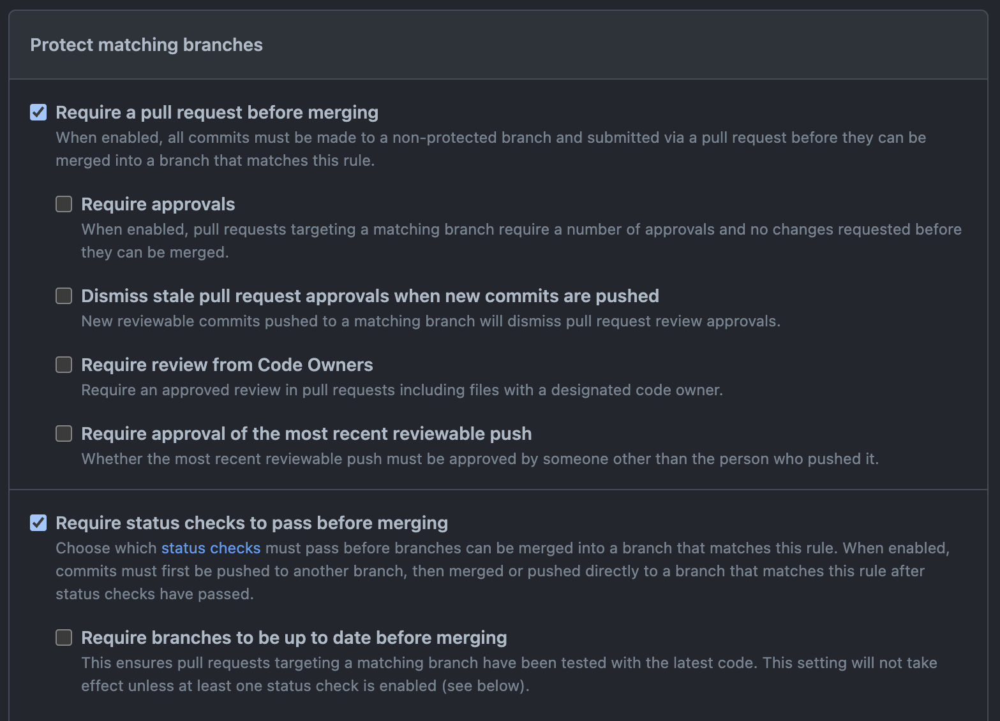

# Branch Enforcement Action

[](https://github.com/ncalteen/branch-enforcement/actions/workflows/codeql.yml)
[](https://github.com/ncalteen/branch-enforcement/actions/workflows/continuous-integration.yml)
[](https://github.com/ncalteen/branch-enforcement/actions/workflows/package-check.yml)
[](https://github.com/ncalteen/branch-enforcement/actions/workflows/super-linter.yml)
[](./badges/coverage.svg)

A demo repository to show how to restrict merging between branches. In this
demo, we will restrict merging to follow the below branch order:

1. `<any branch>` -> `dev`
1. `dev` -> `stg`
1. `stg` -> `qa`
1. `qa` -> `main`

To test this out, you can create a new branch and try to merge it into any
branch besides `dev`. After that, try merging `dev` into `qa` or `main`, and you
should see that the PR is blocked.

This action lets you specify regular expressions to compare the `base` and
`head` refs of a pull request. If an incoming pull request does not match at
least one of the specified regular expressions, the action will fail.

## Usage

To use this action and enforce your merging policy, you will need to do the
following:

### Step 1: Configure Branch Protection

Create a
[branch protection rule](https://docs.github.com/en/repositories/configuring-branches-and-merges-in-your-repository/managing-protected-branches/about-protected-branches)
for each branch you want to restrict. At minimum, the rule must enforce the
following:

- Require a pull request before merging
- Require status checks to pass before merging



### Step 2: Create a Workflow File

Create a new workflow file in your repository. You can do this by creating a new
file in the `.github/workflows` directory. Your workflow must specify the
following:

| Key                | Description                                                                                 |
| ------------------ | ------------------------------------------------------------------------------------------- |
| `on: pull_request` | Trigger the workflow when a pull request is opened or updated.                              |
|                    | This is required to populate the `github.head_ref` and `github.base_ref` context variables. |
| `permissions`      | The workflow must have `write` permissions to statuses.                                     |
|                    | This is required to set the status of the pull request.                                     |

For example, you can create a file called `branch-enforcement.yml` with the
following contents.

> [!NOTE]
>
> The policy should be specified as a YAML string, with each entry on a separate
> line. The format of each entry is `<base>:<head>`, where `<base>` and `<head>`
> are regular expressions.

```yaml
name: Branch Enforcement

on:
  pull_request:

jobs:
  check-branch:
    name: Check Branches
    runs-on: ubuntu-latest

    permissions:
      statuses: write

    env:
      # The branch being merged.
      HEAD_REF: ${{ github.head_ref }}
      # The target branch.
      BASE_REF: ${{ github.base_ref }}

    steps:
      # Policy:
      #   - Any branch can be merged into dev (e.g. feature branches)
      #   - dev can be merged into qa
      #   - qa can be merged into main
      - name: Enforce Merge Policy
        id: enforce-policy
        uses: ncalteen/branch-enforcer@main
        with:
          policy: |
            .*:dev
            dev:qa
            qa:main
          head_ref: ${{ env.HEAD_REF }}
          base_ref: ${{ env.BASE_REF }}

      # This step should not run if the branch policy is not met.
      - name: Policy Passed
        id: passed
        run: echo "This PR passes the merge policy!"
```
